#Aluno:Bruno Rodrigues dos Santos Silva

Disciplina: Integrações Back-end e Publicação de Apps React Native [24E4_3]

#Prints

TELA DE LOGIN

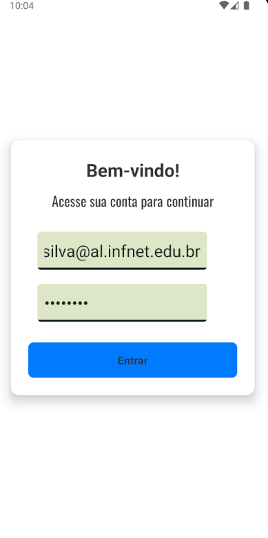
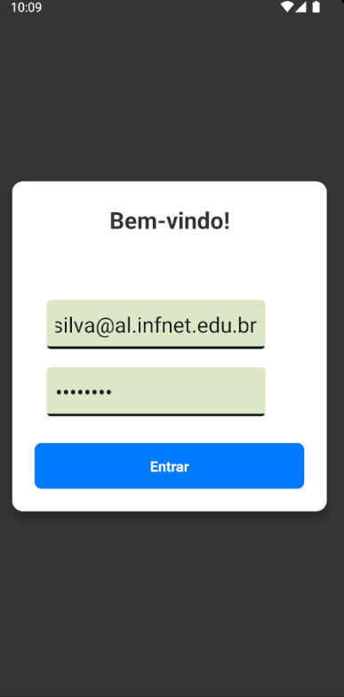

TELA DE CIDADES

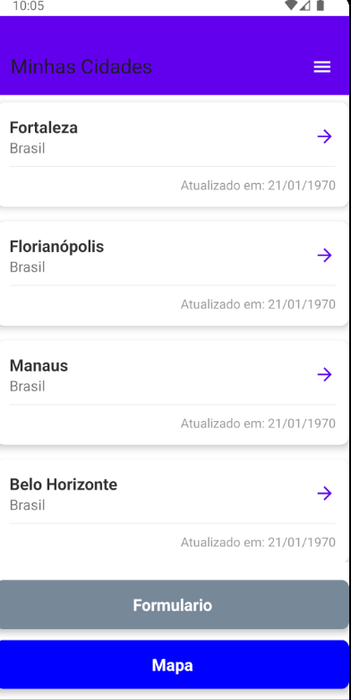
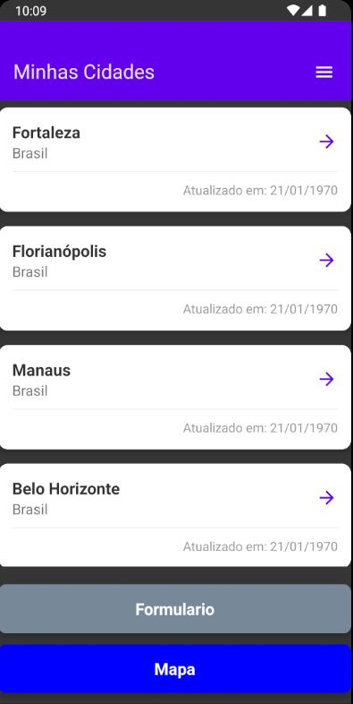

FORMULARIO

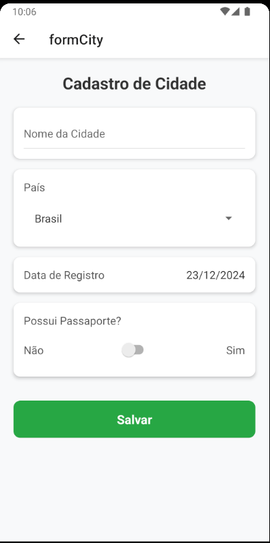
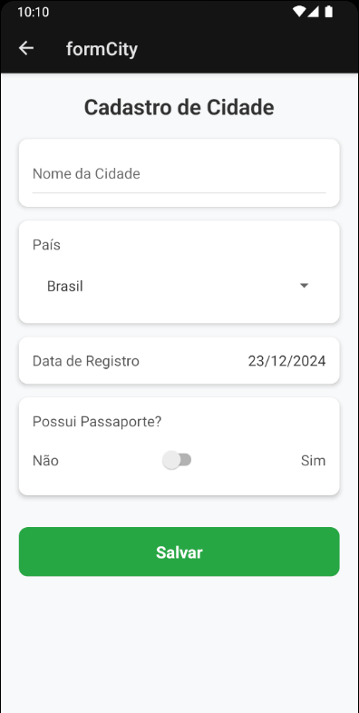

LOCALIZACAO

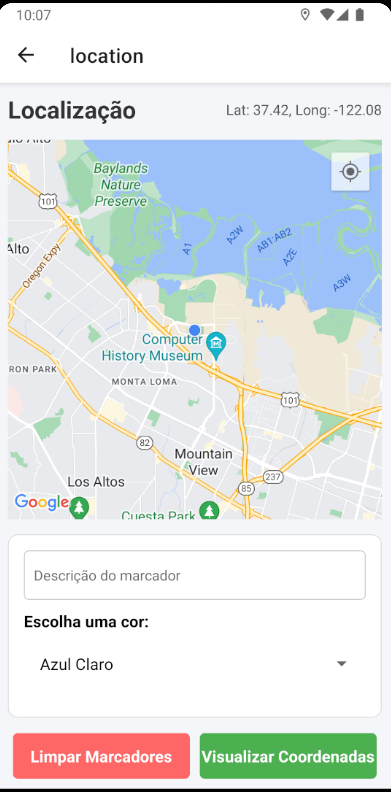
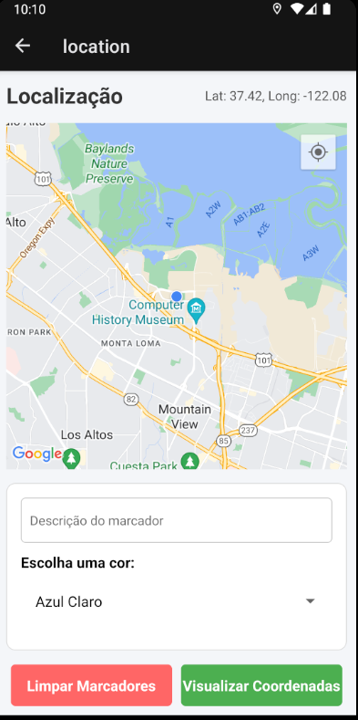

DETALHES CIDADES

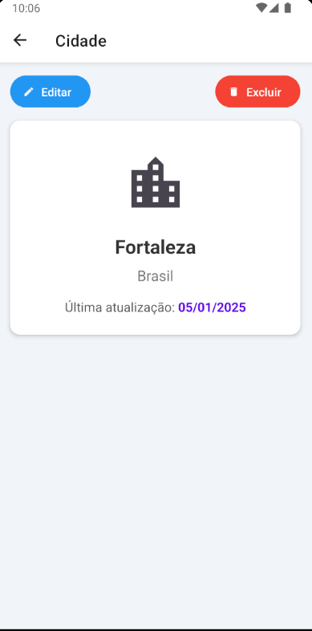
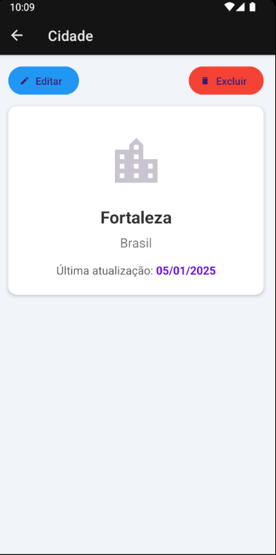

API GraphQL

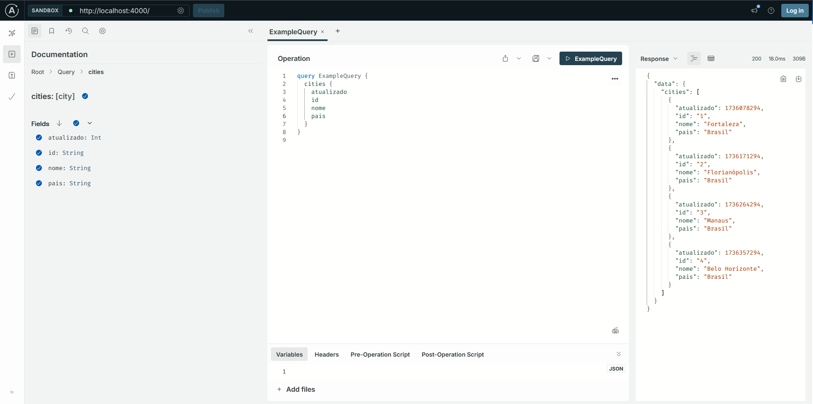

